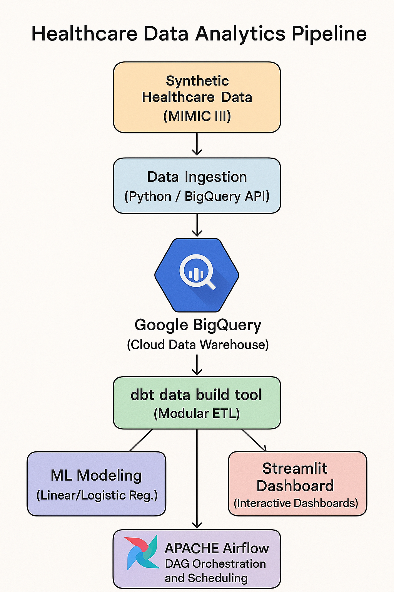

# Health-Tech Analytics Pipeline

Predicting and reducing patient readmission risk using a modern, cloud-native analytics pipeline  
End-to-end demonstration of advanced analytics engineering in healthcare, with BigQuery, dbt, Airflow, and Streamlit.

---



---

## Table of Contents

- [Project Overview](#project-overview)
- [Architecture](#architecture)
- [Tech Stack](#tech-stack)
- [Features](#features)
- [Setup and Reproducibility](#setup-and-reproducibility)
  - [1. GCP and BigQuery Setup](#1-gcp-and-bigquery-setup)
  - [2. Data Ingestion](#2-data-ingestion)
  - [3. dbt Modeling](#3-dbt-modeling)
  - [4. Airflow Orchestration](#4-airflow-orchestration)
  - [5. ML Modeling](#5-ml-modeling)
  - [6. Streamlit Dashboard](#6-streamlit-dashboard)
- [Project Highlights](#project-highlights)
- [Screenshots](#screenshots)
- [References and Further Reading](#references-and-further-reading)
- [Security and Compliance](#security-and-compliance)
- [License](#license)
- [Author and Contact](#author-and-contact)

---

## Project Overview

Hospital readmissions are a major cost and quality concern in healthcare. This project demonstrates a real-world, end-to-end analytics pipeline to predict 30-day patient readmission risk and enable targeted intervention, using public healthcare data.

Key goals:
- Showcase modern analytics engineering skills with real-world data
- Provide a complete, reproducible example for data warehousing, data modeling, orchestration, ML, and BI dashboarding
- Serve as a reference implementation for healthcare data analytics

---

## Architecture

  
Data flows: Data ingest to BigQuery (cloud data warehouse) to dbt (data modeling) to Airflow (orchestration) to ML (Python) to Streamlit (dashboard)

---

## Tech Stack

| Technology        | Purpose                                        | Skills Demonstrated          |
|-------------------|------------------------------------------------|-----------------------------|
| Google BigQuery   | Cloud data warehouse                           | Cloud SQL, IAM, SQL         |
| dbt Core          | Data modeling, transformation, testing         | Modular SQL, custom tests   |
| Apache Airflow    | Workflow orchestration (TaskFlow API)          | DAGs, production ops        |
| Streamlit         | Interactive dashboard                          | BI, stakeholder focus       |
| Python (sklearn)  | Predictive modeling (logistic regression)      | ML, data science            |
| Git/GitHub        | Version control, CI/CD, documentation          | SDLC, DevOps                |

---

## Features

- Cloud-first data warehousing: All raw and modeled data lives in BigQuery (scalable, secure, industry standard).
- Modular analytics engineering: dbt project with layered models (staging, intermediate, marts), plus custom tests/macros and full documentation.
- Production-ready orchestration: Apache Airflow DAG, idempotent and robust, using TaskFlow API and secrets management.
- ML-driven analytics: Predictive logistic regression model, trained on BigQuery data marts, ready for API or real-time use.
- User-centric design: Streamlit dashboard for clinical and business users, with interactive filtering and risk scoring.
- DevOps best practices: Clean repo, CI/CD via GitHub Actions, code reviews, and secure credential handling.

---

## Setup and Reproducibility

This project is fully reproducible and uses only public, de-identified data.

### 1. GCP and BigQuery Setup

- Create a free GCP account
- Create a new project and enable BigQuery
- Create a service account with BigQuery Job User and Data Editor roles
- Download and securely store your service account key (never commit to git)

### 2. Data Ingestion

- Download sample data (for example, AHRQ NRD or Kaggle hospital readmissions dataset)
- Upload CSVs to a GCS bucket or load directly via BigQuery UI or CLI
- Example Python script:

  ```python
  # data/load_to_bq.py
  from google.cloud import bigquery
  client = bigquery.Client.from_service_account_json("your-key.json")
  # Add your load logic here


### 3. dbt Modeling

- Install dbt Core (`pip install dbt-bigquery`)
- Initialize project in `/dbt` and configure `profiles.yml` (see `dbt/README.md`)
- Run:
dbt run
dbt test
dbt docs generate && dbt docs serve


- Review models, custom tests, macros, and docs

---

### 4. Airflow Orchestration

- Spin up Airflow locally (Docker Compose or Astro CLI)
- Place `readmission_dag.py` in `airflow/dags/`
- Configure Airflow connections for BigQuery and secrets via environment variables
- Trigger and monitor DAG runs in the Airflow UI

---

### 5. ML Modeling

- Jupyter or Colab notebook or script in `/modeling`
- Query features from `fct_patient_readmissions` table in BigQuery
- Train logistic regression (or XGBoost, etc.), pickle or export the model

---

### 6. Streamlit Dashboard

- Install requirements (`pip install -r streamlit_app/requirements.txt`)
- Run the app:
cd streamlit_app
streamlit run app.py


- Connects to BigQuery for live metrics and loads ML model for predictions

---

### Project Highlights

- Advanced dbt: Custom generic tests (such as event date logic), reusable macros, dbt docs and exposures
- Robust orchestration: Idempotent, dependency-managed Airflow DAGs with Pythonic TaskFlow
- ML integration: Trained model embedded in Streamlit app for risk scoring
- Stakeholder focus: Dashboard is simple, interactive, and built for clinical utility
- Reproducible and secure: All secrets in .env or Airflow UI; no PHI or proprietary code

---

### Screenshots

Add at least:

- Streamlit dashboard demo (GIF or PNG)
- Airflow DAG run
- dbt docs lineage graph
- Example code snippets with annotations

---

### References and Further Reading

- [NRD Data Overview (AHRQ)](https://www.hcup-us.ahrq.gov/nrdoverview.jsp)
- [dbt Documentation](https://docs.getdbt.com/)
- [Apache Airflow Docs](https://airflow.apache.org/docs/)
- [Streamlit Docs](https://docs.streamlit.io/)
- [BigQuery Python Client](https://cloud.google.com/bigquery/docs/reference/libraries)

---

### Security and Compliance

- No PHI or PII: All data is public, de-identified, and safe for open use
- Secrets management: All credentials are stored securely (never in code or version control)
- HIPAA awareness: Project structure and workflow align with industry best practices for clinical analytics

---

### License

This project is licensed under the MIT License. 

